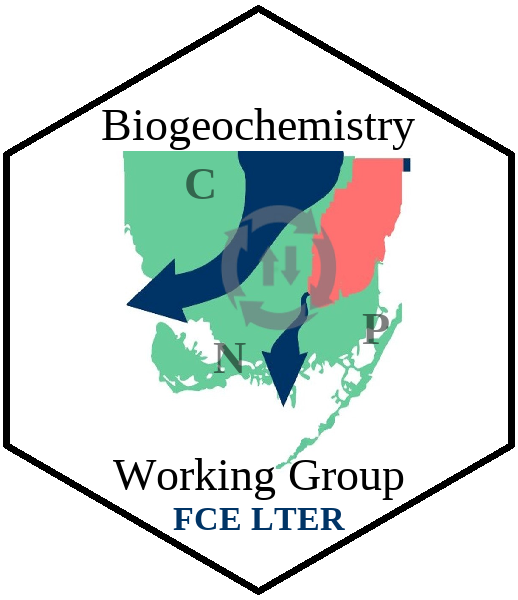

Updated: `r paste(format(Sys.Date(),"%B %d, %Y"))`

```{r setup, include=FALSE}
knitr::opts_chunk$set(echo = TRUE)
knitr::opts_knit$set(eval.after='fig.cap')
```

***

### Suggested Citation

Julian, P. 2019. Florida Coastal Everglades Long-Term Ecological Research interactive water quality (grab samples) data explorer. DOI:10.17605/OSF.IO/Z4KUQ. Accessed (Insert date).

***

<div class = "row">
<div class = "col-md-6">

Welcome to the Florida Coastal Everglades Long Term Ecological Research Biogeochemistry Working group [Shiny applicaion](https://shiny.rstudio.com/). The objective of this application is to allow for user interaction with the FCE LTER data across the LTER and beyond.

As more data becomes available the application will be updated. This application was build using a Shiny-application in a R-markdown framework. The R-markdown file can be found here. This application was developed as part of the Biogeochemistry/Water Properties working group.

</div>

<div class = "col-md-6">

```{r, out.width="40%",fig.show="hold",fig.align="center",echo=FALSE}

```

</div>
</div>

<br> 

- Datasets used in this application include @gaiser_water_2018, @troxler_water_2018-1, and @troxler_water_2018.
- Data were screened for reversals (i.e. dissolved > total).
- Only Sites for Shark River Slough (SRS 1 - 6) and Taylor Slough (TS/Ph 1,2,3,6 and 7) are included in this application.

***

```{r, include=F}
## 
## Florida Coastal Everglades LTER
## Biogeochemistry Working Group
## Grab Sample water quality Shiny app
##
## Code was compiled by Paul Julian
## contact infor: pjulian@ufl.edu


#Libraries
library(AnalystHelper);#devtools::install_github("SwampThingPaul/AnalystHelper")
library(plyr)
library(reshape)
library(zoo);
library(mblm)

library(tmap)
library(rgdal)

library(shiny)
library(kableExtra)

#Paths
wd="D:/_GitHub/FCE-BGChemWG/Trends"

#GIS.path=paste0(wd,"/GIS")
GIS.path="./GIS"

#Helper variables 
N.mw=14.0067
P.mw=30.973762
C.mw=12.0107
utm17=CRS("+proj=utm +zone=17 +ellps=GRS80 +towgs84=0,0,0,0,0,0,0 +units=m +no_defs")

# custom functions
read.lter=function(data.package,PASTA,DOI){
  prefix="http://pasta.lternet.edu/package/data/eml/"
  
  infile1=paste0(prefix,data.package,PASTA,DOI)
  dt1=read.csv(infile1,na.strings=c("-9999","-9999.00","-9999.000"))
  return(dt1)
}

## GIS data
tmap_mode("view")
FCE.LTER.sites=spTransform(readOGR(".","ltersites_utm"),utm17)
region.sites=data.frame(SITE=c("SRS-1a","SRS-1b", "SRS-1c", "SRS-1d", "SRS-2", "SRS-3", "SRS-4", "SRS-5", "SRS-6",  "TS/Ph-1a", "TS/Ph-1b", "TS/Ph-2a","TS/Ph-2b", "TS/Ph-3", "TS/Ph-6a", "TS/Ph-6b","TS/Ph-7a", "TS/Ph-7b","TS/Ph-4", "TS/Ph-5", "TS/Ph-8", "TS/Ph-9","TS/Ph-10", "TS/Ph-11"),
                        Region=c(rep("Shark River Slough",9),rep("Taylor Slough",9),rep("Panhandle",3),rep("Florida Bay",3)))
FCE.LTER.sites=merge(FCE.LTER.sites,region.sites,"SITE")

ENP=spTransform(readOGR(".","ENP_boundary"),utm17)

## Data Import
dat.sources=data.frame(Dataset=c("LT_ND_Losada_002","LT_ND_Grahl_002","LT_ND_Rubio_002","LT_ND_Rondeau_002"),
                       PASTA=c("1075/8/","1073/12/","1080/8/","1077/3/"),
                       DOI=c("ac7159e66cbad75abb61bd1992f8d2c0","15e6ff92f875a272ba6d98db3f738026","3a84ab2009eda6b73e375aa3ad56da1a","832e5493edf5a5d79d8a60535e26a012"))

fce.losada=with(dat.sources[1,],read.lter("knb-lter-fce/",PASTA,DOI))
fce.losada$Dataset.ID=dat.sources$Dataset[1]
fce.grahl=with(dat.sources[2,],read.lter("knb-lter-fce/",PASTA,DOI))
fce.grahl$Dataset.ID=dat.sources$Dataset[2]
fce.rubio=with(dat.sources[3,],read.lter("knb-lter-fce/",PASTA,DOI))
fce.rubio$Dataset.ID=dat.sources$Dataset[3]
fce.rondeau=with(dat.sources[4,],read.lter("knb-lter-fce/",PASTA,DOI))
fce.rondeau$Dataset.ID=dat.sources$Dataset[4]

fce.grahl=rename(fce.grahl,c("NandN"="N.N"));#renaming NOx column to be consistent with other datasets

fce.wq=rbind(fce.grahl,fce.losada,fce.rondeau,fce.rubio)
fce.wq$Date.EST=date.fun(as.character(fce.wq$DATE),form="%Y-%m-%d")
fce.wq$WY=WY(fce.wq$Date.EST)
fce.wq$dec.year=decimal_date(fce.wq$Date.EST)
fce.wq$hydro.season=FL.Hydroseason(fce.wq$Date.EST)
fce.wq$SITENAME=with(fce.wq,ifelse(substring(fce.wq$SITENAME,1,2)=="TS",paste0("TS/PH",substring(fce.wq$SITENAME,6,7)),as.character(fce.wq$SITENAME)))

fce.wq.sites=data.frame(SITENAME=c(paste0("SRS",c("1a","1c","1d",2,3,4,5,6)),paste0("TS/PH",c("1a","1b",2,3,"6b","6a","7a","7b")),paste0("TS/PH",c(4,5,8)),paste0("TS/PH",c(9,10,11))),
                        Region=c(rep("SRS",8),rep("TS",8),rep("Ph",3),rep("FB","3")))
fce.wq=merge(fce.wq,fce.wq.sites,all.x=T)
fce.wq=subset(fce.wq,Date.EST<date.fun("2018-05-01"))

## Parameter reversals
fce.wq$TPReversal.abs=with(fce.wq,ifelse(is.na(SRP)==T|is.na(TP)==T,0,ifelse(SRP>TP,1,0)))
fce.wq$TPReversal=with(fce.wq,ifelse(is.na(SRP)==T|is.na(TP)==T,0,ifelse(SRP>(TP*1.3),1,0)));# Reversals identified as 1 reversals consistent with TP rule evaluation
fce.wq$OCReversal=with(fce.wq,ifelse(is.na(DOC)==T|is.na(TOC)==T,0,ifelse(DOC>(TOC*1.3),1,0)));
fce.wq$TNReversal=with(fce.wq,ifelse(is.na(N.N+NH4)==T|is.na(TN)==T,0,ifelse((N.N+NH4)>(TN*1.3),1,0)));

##Convert uM concentrations to ug/L (P-species) or mg/L (N and C species)
fce.wq$TP=round((fce.wq$TP*P.mw),4);#convert uM concentration to ug/L
fce.wq$TN=round((fce.wq$TN*N.mw)*0.001,2);#convert uM concentration to mg/L
fce.wq$TOC=round((fce.wq$TOC*C.mw)*0.001,2);#convert uM concentration to mg/L
fce.wq$DOC=round((fce.wq$DOC*C.mw)*0.001,2);#convert uM concentration to mg/L
fce.wq$SRP=with(fce.wq,ifelse(SRP<0.01,0.01,SRP))
fce.wq$SRP=round((fce.wq$SRP*P.mw),4);#convert uM concentration to ug/L
fce.wq$N.N=with(fce.wq,ifelse(N.N<=0,0.01,N.N))
fce.wq$DIN=with(fce.wq,N.N+NH4)
fce.wq$DIN=with(fce.wq,round((DIN*N.mw)*0.001,4));#convert uM concentration to mg/L

names(fce.wq)
id.vars.val=c("SITENAME","Region","Dataset.ID","Date.EST","WY","hydro.season","dec.year")
param.vars.val=c("TP","SRP","TN","DIN","DOC")

fce.wq.stack=melt(fce.wq[,c(id.vars.val,param.vars.val)],id.vars=id.vars.val,variable_name = "parameter")

rev.list=list(fce.wq[,c("SITENAME","Date.EST","TPReversal")],fce.wq[,c("SITENAME","Date.EST","TNReversal")],fce.wq[,c("SITENAME","Date.EST","OCReversal")])
for(i in 1:3){
colnames(rev.list[[i]])=c("SITENAME","Date.EST","Reversal")
}
names(rev.list)=c("TP","TN","OC")

param.list=c("TP","SRP","TN","DIN","DOC")
rev.param.list=c("TP","TP","TN","TN","OC")

fce.wq.stack.qa=data.frame()
for(i in 1:length(param.list)){
  tmp=subset(fce.wq.stack,parameter==param.list[i])
  tmp=merge(tmp,rev.list[[rev.param.list[i]]],c("SITENAME","Date.EST"))
  fce.wq.stack.qa=rbind(fce.wq.stack.qa,tmp)
}
fce.wq.stack.qa=subset(fce.wq.stack.qa,is.na(value)==F)

WQ.WY=ddply(subset(fce.wq.stack.qa,Reversal==0),c("SITENAME","WY","Region","parameter"),summarise,mean.val=mean(value,na.rm=T),GM.val=exp(mean(log(value),na.rm=T)),N.val=N(value))#,N.val=N(value))
WQ.WY$dec.yr=with(WQ.WY,WY+0.328);#decimal date for Apirl 30th 
WQ.WY$mean.val=with(WQ.WY,ifelse(N.val<4,NA,mean.val))
WQ.WY$GM.val=with(WQ.WY,ifelse(N.val<4,NA,GM.val))

idvars=c("SITENAME","WY","Region","parameter","dec.yr")
WQ.WY=melt(WQ.WY[,c(idvars,"mean.val","GM.val")],id.vars=idvars)

## Helper Tables
ann.stats.table=data.frame(Radio=c("Arithmetic Mean","Geometric Mean"),variable=c("mean.val","GM.val"))

param.list.plot=data.frame(parameter=c("TP","TN","SRP","DIN","DOC"),
                           shiny.names=c("Total Phosphorus","Total Nitrogen","Soluable Reactive Phosphorus","Dissolved Inorganic Nitrogen","Dissolved Organic Carbon"))


#ylim.vals=data.frame(parameter=c("TP","TN","SRP","DIN","DOC"),ylim.min=c(1,0.1,0.1,0.01,1),ylim.max1=c(200,6,80,4,60),ylim.max2=c(70,3,30,2,40),by.y=c(20,1,10,0.5,10))

#for log scale
ylim.vals=data.frame(parameter=c("TP","TN","SRP","DIN","DOC"),ylim.min=c(1,0.1,0.1,0.01,1),ylim.max1=c(200,6,80,4,60),ylim.max2=c(40,2,20,0.5,30),by.y=c(20,1,10,0.5,10))

ylabs.vals=data.frame(parameter=c("TP","TN","SRP","DIN","DOC"),labs=c("Total Phosphorus (\u03BCg/L)","Total Nitrogen (mg/L)","Soluable Reactive Phosphorus (\u03BCg/L)","Dissolved Inorganic Nitrogen (mg/L)","Dissolved Organic Carbon (mg/L)"))

ylim.vals.boxplot=data.frame(parameter=c("TP","TN","SRP","DIN","DOC"),ylim.min=c(1,0.1,0.1,0.01,5),ylim.max=c(200,6,10,1,60))

```


```{r plan Map,echo=FALSE,message=FALSE,out.width="100%"}
cols=RColorBrewer::brewer.pal(4,"Paired")

tm_basemap(leaflet::providers$Esri.WorldImagery,alpha=0.9)+
  tm_shape(FCE.LTER.sites,is.master = T)+tm_dots(col="Region",alpha=1,title="Regions",palette = cols,size=0.1)+
  tm_shape(ENP)+tm_borders(col="grey",lwd=2)
```

<center> Interactive map of monitoring locations within the Florida Coastal Everglades (FCE) Long Term Ecological Research (LTER) site. </center>

<br>


```{r in,echo=F}
#inputPanel(

sidebarPanel(  
selectInput("param.val",label="Choose a Water Quality Variable:",
             choices=list("Total Phosphorus","Total Nitrogen","Soluable Reactive Phosphorus","Dissolved Inorganic Nitrogen","Dissolved Organic Carbon")),
br(),

  selectInput("site.val",label="Select a FCE-LTER Site:\n",
             choices=subset(fce.wq.sites,Region!="FB")$SITENAME),
br(),
  sliderInput("WY.val", label =  "Florida Water Year (May - Apirl):",
              min = 2002, max = max(WQ.WY$WY,na.rm=T), value = c(2002,2018),step = 1,sep=""),
br(),  
radioButtons("annstat","Annual Statistic:",c("Arithmetic Mean","Geometric Mean")),
   br(),
   img(src="FCE_logo.png", height = 100, width = 150, align="center")
)

```

```{r plot,echo=F,fig.width=6,fig.height=7,fig.align='center'}

#output$unsized <-
mainPanel(  renderPlot({
  param.sel=subset(param.list.plot,shiny.names==input$param.val)$parameter
  WY.val=input$WY.val
  site.sel=input$site.val
  stat=input$annstat
  
  WY.tmp.dat=subset(merge(WQ.WY,ann.stats.table,"variable"),parameter==param.sel&SITENAME==site.sel&WY%in%c(WY.val[1]:WY.val[2])&Radio==stat)
  WY.tmp.dat$cuSum=with(WY.tmp.dat,round(cumsum(base::scale(value)),1))
  tmp.da.dat=subset(fce.wq.stack.qa,Reversal==0&parameter==param.sel&SITENAME==site.sel&WY%in%c(WY.val[1]:WY.val[2]))
  
  ##
  xlim.val=c(WY.val);by.x=5;xmaj1=seq(xlim.val[1],xlim.val[2],by.x);xmin1=seq(xlim.val[1],xlim.val[2],by.x/by.x)
  xlim.val2=c(date.fun(c(paste0(WY.val[1]-1,"-05-01"),paste0(WY.val[2],"-05-01"))))
  xmaj2=seq(xlim.val2[1],xlim.val2[2],"2 year");xmin2=seq(xlim.val2[1],xlim.val2[2],"1 year")
  
  ylim.val1=with(subset(ylim.vals,parameter==param.sel),c(ylim.min,ylim.max1))
  ymaj1=log.scale.fun(ylim.val1,"major");ymin1=log.scale.fun(ylim.val1,"minor")
  
  ylim.val2=with(subset(ylim.vals,parameter==param.sel),c(ylim.min,ylim.max2))
  by.y=subset(ylim.vals,parameter==param.sel)$by.y
  
  ymaj2=log.scale.fun(ylim.val2,"major")#seq(ylim.val2[1],ylim.val2[2],by.y),1);
  ymin2=log.scale.fun(ylim.val2,"minor")#round(seq(ylim.val2[1],ylim.val2[2],by.y/2)
  ylim.val.alt=c(floor(min(WY.tmp.dat$cuSum)),ceiling(max(WY.tmp.dat$cuSum)));ymaj.alt=seq(ylim.val.alt[1],ylim.val.alt[2],diff(ylim.val.alt)/2);ymin.alt=seq(ylim.val.alt[1],ylim.val.alt[2],diff(ylim.val.alt)/4)
  
  par(family="serif",mar=c(2,2,2.25,4),oma=c(2.5,3.5,1,1.25))
  layout(matrix(c(1:3,rep(4,3)),2,3,byrow=T),widths=c(1,1,0.5))

  plot(value~WY,WY.tmp.dat,xlim=xlim.val,ylim=ylim.val2,yaxt="n",xaxt="n",ylab=NA,xlab=NA,type="n",log="y")
  abline(h=ymaj2,v=xmaj1,lty=3,col="grey")
  with(WY.tmp.dat,points(WY,value,pch=21,bg="indianred1",cex=2))
  if(nrow(WY.tmp.dat)>3){
    mod=mblm(value~WY,WY.tmp.dat)
    pred.x=c(min(WY.tmp.dat$WY,na.rm=T):max(WY.tmp.dat$WY,na.rm=T))
    pred.mod=data.frame(predict(mod,data.frame(WY=pred.x),interval="confidence"))
    lines(pred.x,pred.mod$fit,col="dodgerblue1",lwd=2);
    lines(pred.x,pred.mod$lwr,col="dodgerblue1",lwd=1,lty=2)
    lines(pred.x,pred.mod$upr,col="dodgerblue1",lwd=1,lty=2)
    }
  axis_fun(1,xmaj1,xmin1,xmaj1,cex=1.5);axis_fun(2,ymaj2,ymin2,format(ymaj2),cex=1.5);box(lwd=1)
  mtext(side=1,line=2,"Water Year",cex=1.25)

  plot(value~WY,WY.tmp.dat,xlim=xlim.val,ylim=ylim.val.alt,yaxt="n",xaxt="n",ylab=NA,xlab=NA,type="n")
  abline(h=ymaj.alt,v=xmaj1,lty=3,col="grey")
  with(WY.tmp.dat,pt_line(WY,cuSum,2.5,"grey",1,22,"grey",2.5))
  axis_fun(2,ymaj.alt,ymin.alt,format(ymaj.alt),cex=1.5)
  mtext(side=2,line=3,"Cumulative Sum",cex=1.25)
  axis_fun(1,xmaj1,xmin1,xmaj1,cex=1.5);
  box(lwd=1)
  mtext(side=3,line=-0.5,site.sel,cex=1.25,outer=T)
  mtext(side=1,line=2,"Water Year",cex=1.25)
  
  plot(0:1,0:1,axes=F,type="n",ylab=NA,xlab=NA)
  legend(0.5,1,legend=c("Data","Cumulative\nSum","Annual trend\n\u00B1 95% CI"),pch=c(21,22,NA),pt.bg=c("indianred1","grey",NA),lty=c(NA,NA,1),col=c(NA,NA,"dodgerblue1"),pt.cex=2,ncol=1,cex=2,bty="n",y.intersp=1,x.intersp=0.75,xpd=NA,xjust=0.5)
  
    plot(value~Date.EST,tmp.da.dat,xlim=xlim.val2,ylim=ylim.val1,log="y",yaxt="n",xaxt="n",ylab=NA,xlab=NA,type="n")
  abline(h=ymaj2,v=xmaj1,lty=3,col="grey")
  with(tmp.da.dat,pt_line(Date.EST,value,2.5,adjustcolor("dodgerblue1",0.5),1,21,"dodgerblue1",2))
  k=with(tmp.da.dat,lowess(as.numeric(Date.EST),value,f=0.4))
  k$x2=date.fun(as.POSIXct(as.numeric(k$x),origin="1970-01-01"))
  lines(k$x2,k$y,lty=1,col="red",lwd=2)
  axis_fun(1,xmaj2,xmin2,format(xmaj2,"%m-%Y"),cex=1.5);axis_fun(2,ymaj1,ymin1,format(ymaj1),cex=1.5);box(lwd=1)
  mtext(side=2,line=1.25,outer=T,subset(ylabs.vals,parameter==param.sel)$labs,cex=2)
  mtext(side=1,line=3,"Date (month-year)",cex=1.5)
  legend("topleft",legend=c("Data","LOWESS"),pch=c(21,NA),lty=c(NA,1),col=c(NA,"red"),pt.bg=c("dodgerblue1",NA),pt.cex=2,ncol=2,cex=2,bty="n",y.intersp=1,x.intersp=0.75,xpd=NA,xjust=0.5)
})
)
#1in=96px
#renderUI({
#  plotOutput("unsized",width="100%",height="480px")
#})

```

<center> **Top:** Annual (arithmetric) mean based on Florida water year (May to April), annual trend line (Sen Slope $\pm$ 95% Confidence Interval) and cumulative sums consistent with [@regier_analyzing_2019]. **Bottom:** Individual grab samples with a Locally Weighted Scatterplot Smoothing ([LOWESS](https://www.statisticshowto.datasciencecentral.com/lowess-smoothing/){target="_blank"}).
</center>


<br>


```{r tab,echo=F,fig.align="center",fig.cap="Annual trend analysis results."}
renderUI({
  param.sel=subset(param.list.plot,shiny.names==input$param.val)$parameter
  WY.val=input$WY.val
  site.sel=input$site.val
  stat=input$annstat
  
  WY.tmp.dat=subset(merge(WQ.WY,ann.stats.table,"variable"),parameter==param.sel&SITENAME==site.sel&WY%in%c(WY.val[1]:WY.val[2])&Radio==stat)
  
  if(nrow(WY.tmp.dat)>3){
    mod=mblm(value~WY,WY.tmp.dat)
    cortest.val=with(WY.tmp.dat,cor.test(value,WY,method="kendall"))
    kable.trend=data.frame(Sen=signif(as.numeric(coef(mod)[2]),2),tau=signif(as.numeric(cortest.val$estimate),2),pval=ifelse(cortest.val$p.val<0.01,"<0.01",round(cortest.val$p.val,2)))
  }


HTML(knitr::kable(kable.trend,row.names=NA,col.names=c("Thiel-Sen Slope","Kendall's \u03C4","\u03C1-value"),caption=paste0("Annual trend analysis comparing ",tolower(input$annstat)," ",tolower(input$param.val)," between water years ",input$WY.val[1]," and ",input$WY.val[2],"."),align=c('c','c','c'))%>%
kable_styling(bootstrap_options = "condensed", full_width = F)%>%
  footnote(general=" ",
           number=c("Thiel-Sen Slope estimated using \nthe mblm R-library (mblm() function)","Kendall's \u03C4 and \u03C1-value determined \nusing the base R-library (cor.test() function)."),
           symbol = c("Only annual data with greater than four individual samples were included in this analysis.")))
  
})
```


```{r tab2,echo=F,fig.align="center",fig.cap="Annual trend analysis results."}
renderUI({
  param.sel=subset(param.list.plot,shiny.names==input$param.val)$parameter
  WY.val=input$WY.val
  site.sel=input$site.val
  stat=input$annstat
  
 tmp.da.dat=subset(fce.wq.stack.qa,Reversal==0&parameter==param.sel&SITENAME==site.sel&WY%in%c(WY.val[1]:WY.val[2]))
  
  WY.tmp.dat=subset(merge(WQ.WY,ann.stats.table,"variable"),parameter==param.sel&SITENAME==site.sel&WY%in%c(WY.val[1]:WY.val[2])&Radio==stat)
  
  da.stats=c(signif(mean(tmp.da.dat$value,na.rm=T),2),signif(sd(tmp.da.dat$value,na.rm=T),2),N(tmp.da.dat$value),signif(min(tmp.da.dat$value,na.rm=T),2),signif(max(tmp.da.dat$value,na.rm=T),2))
  WY.stats=c(signif(mean(WY.tmp.dat$value,na.rm=T),2),signif(sd(WY.tmp.dat$value,na.rm=T),2),N(WY.tmp.dat$value),signif(min(WY.tmp.dat$value,na.rm=T),2),signif(max(WY.tmp.dat$value,na.rm=T),2))
  
 summary.stats=data.frame(stats=c("mean","standard deviation","N","Minimum","Maximum"),GrabSamp=da.stats,WY=WY.stats)
  
  
HTML(knitr::kable(summary.stats,row.names=NA,col.names=c("Summary Statistics","Grab Samples","Annual Data"),caption=paste0("Summary statistics for individual grab samples (i.e. monthly data) and annual ",tolower(input$annstat)," ",tolower(input$param.val)," between water years ",input$WY.val[1]," and ",input$WY.val[2],"."),align=c('c','c','c'))%>%
kable_styling(bootstrap_options = "condensed", full_width = F)%>%
  footnote(general=" ",
           symbol = c("Only annual data with greater than four individual samples were included in this analysis.")))
  
})
```


<br>
<br>

```{r boxplot,echo=F,fig.align="center",fig.width=3,fig.height=7,fig.cap="Test"}
renderPlot({
  param.sel=subset(param.list.plot,shiny.names==input$param.val)$parameter
  WY.val=input$WY.val
  site.sel=input$site.val
  stat=input$annstat
  
  all.dat=subset(fce.wq.stack.qa,Reversal==0&parameter==param.sel&SITENAME==site.sel)
  all.dat$Period="Entire POR"
  
  tmp.da.dat=subset(fce.wq.stack.qa,Reversal==0&parameter==param.sel&SITENAME==site.sel&WY%in%c(WY.val[1]:WY.val[2]))
  tmp.da.dat$Period=paste0("WY",WY.val[1]," - ",WY.val[2])
  
  box.dat=rbind(all.dat[,c("Period","value")],tmp.da.dat[,c("Period","value")])
  xlabs=c("POR",paste0("WY",WY.val[1]," - ",WY.val[2]))
  
  ylim.vals.boxplot
  ylim.val=with(subset(ylim.vals.boxplot,parameter==param.sel),c(ylim.min,ylim.max))
  ymaj=log.scale.fun(ylim.val,"major");ymin=log.scale.fun(ylim.val,"minor")
  
  
  
  par(family="serif",mar=c(2,2,2.25,4),oma=c(2,2,1,1.25))
  layout(matrix(c(1:3,rep(4,3)),2,3,byrow=T),widths=c(0.5,1,0.5),heights=c(1,0.25))
  
  plot(0:1,0:1,axes=F,type="n",ylab=NA,xlab=NA)
  boxplot(value~Period,box.dat,yaxt="n",xaxt="n",ylim.val=ylim.val,log="y",ylab=NA,xlab=NA,col=adjustcolor(c("dodgerblue1","indianred1"),0.5),outline=F)
  axis_fun(2,ymaj,ymin,format(ymaj),cex=1.5)
  axis_fun(1,line=-0.1,1:2,1:2,xlabs,cex=1.5)
  mtext(side=2,line=3.75,subset(ylabs.vals,parameter==param.sel)$labs,cex=1.5)
  mtext(side=1,line=2.5,"Period of Comparison",cex=1.5)
  plot(0:1,0:1,axes=F,type="n",ylab=NA,xlab=NA)
  plot(0:1,0:1,axes=F,type="n",ylab=NA,xlab=NA)
  text(0.5,0.5,paste0("Boxplot comparison of grab-sample ",tolower(input$param.val)," between water years \n", input$WY.val[1]," and ",input$WY.val[2]," and the entire period of record (POR) for ", input$site.val,". "),cex=2 )
})

```

<!--

***

### Task Lists
Since this is a work *in-progress* here are some items on the task list. If you would like to see additional items on this application let us know what else you would like to see by sending an [email](mailto:pjulian@ufl.edu) to the developer.

- [X] ~~Build base shiny application.~~
- [X] ~~Include summary tables.~~
- [X] ~~Include trend analysis outputs.~~
- [ ] add boxplots for period comparisons.

***

Created and Maintained by Paul Julian, PhD PWS  [`r icon::fa("envelope")`](mailto:pauljulianphd@gmail.com) [`r icon::fa("chrome")`](https://swampthingpaul.github.io) [`r icon::fa("twitter")`](https://twitter.com/SwampThingPaul) [`r icon::fa("github")`](https://github.com/SwampThingPaul)    


Code hosted at [`r icon::fa("github")`](https://github.com/SwampThingPaul/FCE-BGChemWG)
-->

***

## References